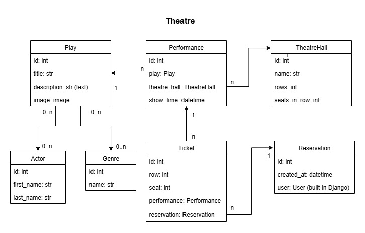

# Theatre Service API

API service for Theatre management written on DRF and Dockerized


# Installing using GitHub

Install PostgresSQL and create db

```shell
git clone https://github.com/DmytroDeviatlytskyi/theatre-service.git
cd theatre-service-api
python -m venv venv
venv\bin\activate
pip install -r requirements.txt
set DB_HOST=<your db hostname>
set DB_NAME=<your db name>
set DB_USER=<your db username>
set DB_PASSWORD=<your db user password>
set SECRET_KEY=<your secret key>
python manage.py migrate
python manage.py loaddata dump.json
python manage.py runserver
```


# Run with docker

Docker should be installed (you can download it here: https://www.docker.com/)

```shell
docker-compose build
docker-compose up
```
- Create new admin user. ```docker-compose run theatre sh -c "python manage.py createsuperuser"```;
- Run tests using different approach: ```docker-compose run theatre sh -c "python manage.py test"```;
- Load data into the database: ```docker-compose run theatre sh -c "python manage.py loaddata dump.json"```


# Getting access

To access the API endpoints, follow these steps:

1. Go to URL:
   - [Get token](http://127.0.0.1:8000/api/v1/user/token/)

2. Type in your Email & Password. Example:
   - Email address: admin@example.com
   - Password: admin123

3. After submitting your credentials, you will receive a token. This token grants access to the API endpoints.

Please note that accessing certain endpoints may require the ModHeader extension, which is available for installation in Chrome.


# Getting Started With Api

Go to the URL provided: [API Endpoints](http://127.0.0.1:8000/api/v1/theatre/). 
This URL provides all endpoints of the API.


# Features

- JWT authentication
- Documentation located at `/api/v1/doc/swagger/`
- Admin panel available at `/admin/`
- Creating plays with genres, actors
- Creating theatre halls
- Adding performances
- Managing reservations and tickets
- Filtering Play by: Title(?title=), Genres(?genres=), Actors(?actors)
- Filtering Performance by: Date(?date=), Play(?play=)

# DB Structure
